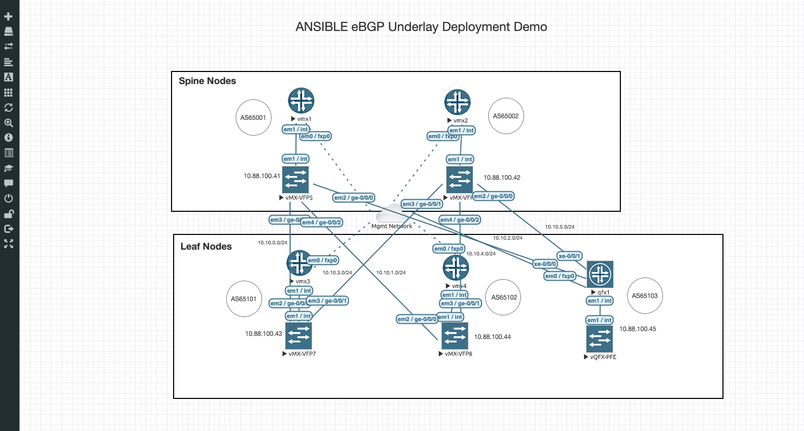
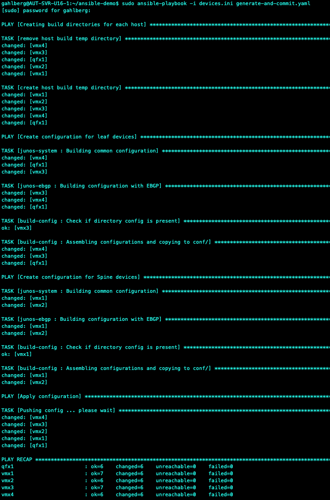

## Ansible Playbooks to build an Underlay configuration onto vMX and vQFX nodes in EVE-NG or WISTAR

This is a set of Ansible Playbooks that will generate two configuration files for each node that uses Jinja2 Templates to build the following configuration files:

	1.	 A System and Common Configuration ( junos-system role )
	
	2.	An eBGP configuration for the IP Fabric ( junos-ebgp role )
	
It will join the two configurations above into a single file with the build-config role.

The main Ansible Playbook generate-and-commit.yaml uses the junos_install_config from Ansible Galaxy which going forward will be replaced with juniper_junos_config (which now contains the modules junos_commit, junos_get_config, junos_install_config, and junos_rollback).  As of this posting, this repository still uses junos_install_config.

The devices.ini file is the Ansible inventory file which contains parameters you would change specific to your environment, such as the junos_host under juniper:children and host variables under juniper:vars.

To run the playbook simply issue as root:

	sudo ansible-playbook -i devices.ini generate-and-commit.yaml

## Supported Lab Environments and System Requirements
To run this the following lab simulation tools have been tested:

WISTAR

	https://github.com/Juniper/wistar

EVE-NG

	https://www.eve-ng.net/

Although setting these up is out of scope for this document, some suggestions and what was tested is provided here for guidance.

1.	For WISTAR, I have a dedicated DELL R610 running Ubuntu 16.04 Xenial with the following specs:

	•	Dual core CPU with 24 Logical Processors
	
	•	192 GB RAM
	
	•	2 TB hard-drive
	

2.	For Eve-NG, it is an Ubuntu 16.04 Xenial VM per the EVE-NG OVA install running on ESXi 6.5 with the following specs for the Server and VM:

	•	The Server (dedicated) is a DELL R610 with Dual Core CPUs with 16 Logical Processors
	
	•	192 GB RAM
	
	•	3 TB hard-drive
	

	•	Eve-NG VM is 16 vCPUs (and be sure to check the box under CPU for – Expose hardware assisted virtualization to the guest OS
	
	•	128 GB RAM
	
	•	1TB hard-drive
	

## Juniper VMs tested
The following Juniper VMs have been tested:

1.	vMX – 17.1R1.8
2.	vQFX RE – 15.1X53-D60
3.	vQFX PFE – cosim 20160609-2

## How do I get started?
The first step (if you don’t have one already) is to build an Ansible Control Server VM (in my case Ubuntu 16.04) with all required packages, cloning this repository from GitHub, and listed VM specs that I have tested this with:

•	VM Ubuntu 16.04 with 6 vCPUs
•	16 GB RAM
•	250 GB hard-drive

After building your VM complete the following steps:

1.	To Install Ansible and PPA on your VM:

	•	$ sudo apt update 
	
	•	$ sudo apt install software-properties-common
	
	•	$ sudo apt-add-repository --yes --update ppa:ansible/ansible
	
	•	$ sudo apt install ansible
	

2.	PyEZ installation

	•	sudo apt-get update
	
	•	sudo apt-get install python-dev libxml2-dev python-pip wget
	
	•	wget https://bootstrap.pypa.io/get-pip.py -O - | sudo python
	
	•	sudo apt-get install libxslt1-dev libssl-dev libffi-dev
	
	•	You also may need these: 
	
		•	sudo apt-get install python-setuptools
		
		•	pip install -U setuptools
		
		•	pip install cryptography
		
		•	pip install enum
		
		•	pip install enum34
		
		•	pip install ipaddress
		
	•	sudo pip install junos-eznc
	
	•	sudo pip install -U junos-eznc
	

3.	Installation of Ansible modules for Junos automation (Ansible Galaxy):

	•	sudo apt-get update
	
	•	sudo apt-get upgrade
	
	•	sudo apt-get install -y python-dev libxml2-dev python-pip libxslt1-dev build-essential libssl-dev libffi-dev git
	
	•	sudo pip install junos-eznc jxmlease wget jsnapy requests 
	
	•	ansible-galaxy install Juniper.junos
	

4.	After successful Installation proceed to your home directory and clone the repository;

	•	git clone https://github.com/gahlberg/ansible-demo.git

5.	And once your WISTAR VMs are setup and running with mgmt IPs run the Ansible Playbook:

	•	sudo ansible-playbook -i devices.ini generate-and-commit.yaml
	
	You should see output similar to the following:
	
	
